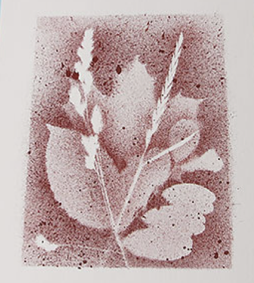

---
disablearabicstart: true
lang: de-DE
include-after: ["Tierspuren-Memory.pdf", "Pflanzen-Memory.pdf"]
forceimages: true
force-image-position: true
link-citations: true
lof: true
lot: false
...

\pagenumbering{roman}
\setcounter{page}{4}

\section*{Vorwort}
\addcontentsline{toc}{section}{Vorwort}
\markright{Vorwort}

Diese Hilfe für Sippenabende ist eine Sammlung von \textcolor{red}{text} Lili... 
Das Vorwort muss noch ergänzt werden...

&nbsp;

\underline{Lili ist doof}

\pagebreak

\pagenumbering{arabic}

# Programm-Ideen für Sippenabende

## Jütebeutel

\underline{Alter}
Jedes Alter

\underline{Dauer}
1 Sippenabend

\underline{Material}
* Jütebeutel
* Stoffmalfarben/Stoffmalstifte (z.B. von Dm)
* Bleistifte
* Radiergummis
* Zeitungspapier

\underline{Vorbereitung/Nachbereitung}
Als Vorbereitung muss nur das Material eingekauft werden. Ansonsten sollte besonders beim Arbeiten mit Farbe anstelle von Stiften etwas mehr Zeit zur Nachbereitung eingeplant werden.

\underline{Durchführung}
Die Sipplinge bemalen die Jütebeutel zunächst mit Bleistift und skizzieren sie vor. Dabei kann sich überlegt werden, ob man als Sippe etwas gemeinsam malt oder, ob jeder etwas individuelles malt. Dann können die Jütebeutel bemalt werden und beispielsweise auf Fahren als Beutel fürs Schwimmbad benutzt werden. 

Wichtig bei der Durchführung ist, darauf zu achten, dass mit der Farbe nichts dreckig gemacht wird. Dem kann man zum Beispiel durch das Auslegen von Zeitungspapier vorbeugen.

\pagebreak

## Pfadfinder-Becher

\underline{Alter}
Jedes Alter

\underline{Dauer}
1 Sippenabend

\underline{Material}
* Tassen (entweder von Ikea oder etwas pfadfinerischer von Globetrotter z.B.)
* Porzellanmalstifte (z.B. von Amazon oder Idee)

\underline{Vorbereitung/Nachbereitung}
Als Vorbereitung muss nur das Material besorgt werden.

\underline{Durchführung}
Zunächst müssen sich die Sipplinge überlegen, wie sie ihre Tassen gestalten möchten. Es können auch gut Sippentassen/ Becher erstellt werden. Danach können sie ihrer Kreativität freien Lauf lassen. 

Wichtig für die Kinder ist der Hinweis, dass die Tassen dann nicht in der Geschirrspülmaschine gewaschen werden können.

\pagebreak

## Sippenchronik

\underline{Alter}
Jedes Alter

\underline{Dauer}
1 Sippenabend, danach regelmäßig nach Fahrten

\underline{Material}
* Schönes Album (z.B. von Gusti Leder in der Sternschanze oder von Leuchtturm) 
* Stifte
* Bastelmaterialien (Tesafilm, Klebe, Schere etc.)
* Fotos
* *optional: Kamera*

\underline{Vorbereitung/Nachbereitung}
Als Vorbereitung muss das Album gekauft werden. Außerdem sollten Fotos von der Sippe (Sippenaktionen oder Sippenfahrten) ausgedruckt werden und Bastelmaterialien mitgebracht werden. 

\underline{Durchführung}
Bei der Gestaltung der Sippenchronik stehen der Sippe eigentlich alle Möglichkeiten des Kreativen Schaffens offen. Ist die Sippe gerade erst gegründet, könnte zum Beispiel eine Strichliste angefangen werden, wie oft jeder Sippling auf Fahrt war. Steckbriefe oder eine Seite mit Zitaten aus der Sippe sind andere Ideen. Zudem können Fotos der Fahrten sowie ein Fahrtentagebuch angelegt werden. Des Weiteren kann es Sinn ergeben, die Chronik individuell zu verzieren (die Seiten oder das Cover).

Nachdem die Sippenchronik erstellt wurde, muss sie nach jeder Fahrt mit Texten und Fotos ergänzt werden. Das kann durch den Sippenführer oder die Sipplinge erfolgen.

\pagebreak

## Sippen T-Shirts

\underline{Alter}
Jedes Alter

\underline{Dauer}
1 Sippenabend

\underline{Material}
* Textilstifte (z.B. von Dm oder Amazon)
* pro Sippling ein T-shirt
* Bleistifte/Papier für Schablonen
* weißes Papier

\underline{Vorbereitung/Nachbereitung}
Als Vorbereitung muss nur das Material besorgt werden. Einen Sippenabend vorher sollten die Sipplinge nach ihren Größen gefragt werden. 

\underline{Durchführung}
Die Sipplinge überlegen sich zunächst, wie sie die T-Shirts als Sippe gestalten wollen. Das können sie entweder auf weißem Papier oder direkt auf den T-Shirts machen. Es könnten auch Schablonen gebastelt werden, um das Ganze noch einheitlicher zu gestalten. 

Bevor die Kinder die T-Shirts mit nach Hause nehmen, ergibt es Sinn, nochmal zu gucken wie sie zusammen mit der Farbe jetzt gewaschen werden können.

\pagebreak

## Pfadfinderkalender

\underline{Alter}
Jedes Alter aber 12 Fotos bereits vorhanden

\underline{Dauer}
1-2 Sippenabende (je nachdem, ob die Sippe gemeinsam die Fotos ausdrucken geht)

\underline{Material}
* pro Kind ein Kalender zum Selbstbasteln (z.B. von Budni)
* Stifte
* Scheren
* Kleben
* Fotos
* ggf. weitere Deko-Elemente

\underline{Vorbereitung/Nachbereitung}
Als Vorbereitung muss nur das Material besorgt werden. Die Fotos könnten auch bei einem Sippenabend davor gemeinsam ausgedruckt werden. Dann könnten sich die Sipplinge unterschiedliche Bilder aussuchen und das Ganze wird noch persönlicher!

\underline{Durchführung}
Der Kalender kann ganz individuell beklebt und nach Belieben beschriftet werden. Der Kalender eignet sich Hervorragend als Geschenk und kann deshalb gut an einem/zwei Sippenabenden vor Weihnachten gemacht werden. 

\pagebreak

## Seife

\underline{Alter}
Jedes Alter

\underline{Dauer}
1 Sippenabend

\underline{Material}
* Kernseife (eine pro Person)
* Reiben
* Backaromen zum Bedurften
* Keksformen 
* Schüsseln
* Tütchen
* heißes Wasser

\underline{Vorbereitung/Nachbereitung}
Als Vorbereitung muss nur das Material besorgt werden. Das Putzen kann je nach Sippe etwas länger dauern.

\underline{Durchführung}
Jeder Sippling muss für seine Seife folgendes machen:

#. Kernseife in Schüssel raspeln und etwas heißes Wasser dazu geben
#. Beliebige Backaromen hinzugegeben, damit die Seife duftet
#. Masse in Keksformen geben und in ihnen aushärten lassen (ggf. an einem warmen Ort)

\pagebreak

## Das Spiel mit den Sinnen

\underline{Alter}
Ältere Sipplinge

\underline{Dauer}
1 Sippenabend

\underline{Material}
* Ohrstöpsel 
* Schlafmasken

\underline{Vorbereitung/Nachbereitung}
Als Vorbereitung wäre es lediglich lohnenswert, sich etwas mit dem Thema der Sinne sowie Behinderungen auseinander zu setzen.

\underline{Durchführung}
Die Idee des Programms ist es, dass jeder zweite Sippling für eine Stunde eine „Behinderung“ bekommt. Das funktioniert am besten mit Ohrstöpsel und/oder Schlafmasken für die Augen. Jeder der Sipplinge, der keine „Behinderung“ hat, wird einem anderen als Helfer zugeteilt. Es ist sinnvoll den Sippenabend über ein Brettspiel o.ä. zu spielen, damit die Bedingungen realistischer sind. Damit soll behandelt werden, wie sich eine solche Behinderung anfühlen könnte und das Verständnis der Sipplinge soll erweitert werden. Es sollte darauf geachtet werden, dass das Ganze nicht zu lächerlich gemacht wird und die Sipplinge wirklich reflektieren, wie sie sich fühlen, was sich verändert und wie/ob sich auch die anderen Sinne im Laufe der Stunde verändern. Am Ende des Sippenabends sollte sich Zeit genommen werden, sich darüber zu unterhalten und ein paar Fragen zu stellen.

\pagebreak

## Trockenfilzen

\underline{Alter}
Jüngere Sipplinge

\underline{Dauer}
1 Sippenabend

\underline{Material}
* Filzwolle in unterschiedlichen Farben
* Filznadeln (mehr als Sipplinge - oft gehen welche kaputt) 
* kleine Kissen 
* zur Not Pflaster

\underline{Vorbereitung/Nachbereitung}
Als Vorbereitung muss nur das Material gekauft werden. 

\underline{Durchführung}
Filznadeln funktionieren so, dass sie sehr dünn sind und unten kleine Wiederhaken haben. Bei jedem Stich zieht sie die Wolle durcheinander und sie zieht sich ein wenig fester zusammen. 

Jeder der Sipplinge kriegt etwas Wolle, ein kleines Kissen als Unterlage und eine Filznadel. Dann können sie sich langsam einarbeiten. Wichtig ist, dass sie sehr konzentriert sind, sonst geschieht schnell mal ein kleines Unglück und sie stechen sich. Deshalb sollten auch Pflaster vorhanden sein. Nun können die Sipplinge kreativ werden und filzen, was sie möchten. 

\pagebreak

## Eier anmalen

\underline{Alter}
Jüngere Sipplinge

\underline{Dauer}
1 Sippenabend

\underline{Material}
* ausgepustete Eier
* Wasserfarben
* ein oder mehrere Gläser
* Pinsel
* Zeitungspapier
* Wasser

\underline{Vorbereitung/Nachbereitung}
Als Vorbereitung muss nur das Material mitgebracht werden. Dieses Programm bietet sich natürlich vor allem kurz vor Ostern an.

Es lohnt sich aber einige Wochen vorher die Eltern zu bitten, Eier zu sammeln und jeden Sippling sein eigenes Material mitbringen zu lassen. Der Tisch muss zudem mit Zeitungspapier ausgelegt werden. Die Nachbereitung könnte etwas länger dauern, weil wahrscheinlich der Tisch und der Boden gewischt werden müssen. 

\underline{Durchführung}
Die Sipplinge können nun die Eier bemalen. Man könnte sich auch überlegen, Pfadfindermotive auf die Eier zu malen - als Geschenk für die Eltern.

\pagebreak

## Zahnbürsten-Spritzbilder

\underline{Alter}
Jedes Alter

\underline{Dauer}
1 Sippenabend

\underline{Material}
* weißes Papier (möglichst etwas dicker)
* Papier für Schablonen
* Wasserfarben
* Zahnbürsten
* Zeitung
* *optional: Blätter von draußen*

\underline{Vorbereitung/Nachbereitung}
Als Vorbereitung muss nur das Material besorgt werden und Zeitungspapier auf dem Tisch ausgebreitet werden. Möglicherweise muss danach gewischt werden. Deshalb sollte mehr Zeit für die Nachbereitung eingeplant werden. Zudem sollte die Sipplinge sich ältere Klamotten anziehen.

{width=35%}

\underline{Durchführung}
Zunächst müssen sich die Sipplinge überlegen, wie sie ihre Spritzbilder gestalten wollen. Dazu können sie sich Schablonen besteln oder sich Blätter von draußen suchen. Danach wird einfach etwas Farbe auf den Zahnbürsten aufgetragen und mit den Fingern auf das Blatt gespritzt.

\pagebreak

## Brückenbau

\underline{Alter}

\underline{Dauer}

\underline{Material}

\underline{Vorbereitung/Nachbereitung}

\underline{Durchführung}

\pagebreak

## Kerzen ziehen

\underline{Alter}

\underline{Dauer}

\underline{Material}

\underline{Vorbereitung/Nachbereitung}

\underline{Durchführung}

\pagebreak

## Kerzenhalter für die Kothe oder Jurte

\underline{Alter}

\underline{Dauer}

\underline{Material}

\underline{Vorbereitung/Nachbereitung}

\underline{Durchführung}

\pagebreak

## Selbstgemachte Lagerfeuer-/Ofenanzünder

\underline{Alter}

\underline{Dauer}

\underline{Material}

\underline{Vorbereitung/Nachbereitung}

\underline{Durchführung}

\pagebreak

## Kochstellen

\underline{Alter}

\underline{Dauer}

\underline{Material}

\underline{Vorbereitung/Nachbereitung}

\underline{Durchführung}

\pagebreak

## Spezielle aber nützliche Knoten

\underline{Alter}

\underline{Dauer}

\underline{Material}

\underline{Vorbereitung/Nachbereitung}

\underline{Durchführung}

\pagebreak

## Klemmbrett 

\underline{Alter}

\underline{Dauer}

\underline{Material}

\underline{Vorbereitung/Nachbereitung}

\underline{Durchführung}

\pagebreak

## Gipsmasken

\underline{Alter}

\underline{Dauer}

\underline{Material}

\underline{Vorbereitung/Nachbereitung}

\underline{Durchführung}

\pagebreak

## Bibelquiz

\underline{Alter}

\underline{Dauer}

\underline{Material}

\underline{Vorbereitung/Nachbereitung}

\underline{Durchführung}

\pagebreak

## Stempel-Rallye

\underline{Alter}

\underline{Dauer}

\underline{Material}

\underline{Vorbereitung/Nachbereitung}

\underline{Durchführung}

\pagebreak 

## Bananen-Rallye

\underline{Alter}

\underline{Dauer}

\underline{Material}

\underline{Vorbereitung/Nachbereitung}

\underline{Durchführung}

\pagebreak

## Stammeshalstuchringe 

\underline{Alter}

\underline{Dauer}

\underline{Material}

\underline{Vorbereitung/Nachbereitung}

\underline{Durchführung}

\pagebreak

## Sippenstützen 

\underline{Alter}

\underline{Dauer}

\underline{Material}

\underline{Vorbereitung/Nachbereitung}

\underline{Durchführung}

\pagebreak 

## Tierspurenmemory

\underline{Alter}

\underline{Dauer}

\underline{Material}

\underline{Vorbereitung/Nachbereitung}

\underline{Durchführung}

\pagebreak

## Pflanzenmemory

\underline{Alter}

\underline{Dauer}

\underline{Material}

\underline{Vorbereitung/Nachbereitung}

\underline{Durchführung}

\pagebreak 

## AB-Päckchen

\underline{Alter}

\underline{Dauer}

\underline{Material}

\underline{Vorbereitung/Nachbereitung}

\underline{Durchführung}

\pagebreak

## Morsezeichen

\underline{Alter}

\underline{Dauer}

\underline{Material}

\underline{Vorbereitung/Nachbereitung}

\underline{Durchführung}

\pagebreak

## Knotenbrett

\underline{Alter}

\underline{Dauer}

\underline{Material}

\underline{Vorbereitung/Nachbereitung}

\underline{Durchführung}

\pagebreak

## Kreative Lagerbauten

\underline{Alter}

\underline{Dauer}

\underline{Material}

\underline{Vorbereitung/Nachbereitung}

\underline{Durchführung}

\pagebreak

## Saatbomben basteln

\underline{Alter}

\underline{Dauer}

\underline{Material}

\underline{Vorbereitung/Nachbereitung}

\underline{Durchführung}

\pagebreak

## Essbare Wasserkugeln

\underline{Alter}

\underline{Dauer}

\underline{Material}

\underline{Vorbereitung/Nachbereitung}

\underline{Durchführung}

\pagebreak

## Zitronensirup

\underline{Alter}

\underline{Dauer}

\underline{Material}

\underline{Vorbereitung/Nachbereitung}

\underline{Durchführung}

\pagebreak

## Limonade

\underline{Alter}

\underline{Dauer}

\underline{Material}

\underline{Vorbereitung/Nachbereitung}

\underline{Durchführung}

\pagebreak

## Brausepulver

\underline{Alter}

\underline{Dauer}

\underline{Material}

\underline{Vorbereitung/Nachbereitung}

\underline{Durchführung}

\pagebreak

## Anzünder aus Pappe und Kerzenwachs

\underline{Alter}

\underline{Dauer}

\underline{Material}

\underline{Vorbereitung/Nachbereitung}

\underline{Durchführung}

\pagebreak

## Papiersterne

\underline{Alter}

\underline{Dauer}

\underline{Material}

\underline{Vorbereitung/Nachbereitung}

\underline{Durchführung}

\pagebreak

## Faschings-/Halloweenmasken 

\underline{Alter}

\underline{Dauer}

\underline{Material}

\underline{Vorbereitung/Nachbereitung}

\underline{Durchführung}

\pagebreak

## Marmelade

\underline{Alter}

\underline{Dauer}

\underline{Material}

\underline{Vorbereitung/Nachbereitung}

\underline{Durchführung}

\pagebreak

## Bibel bemalen, einschlagen & Lesezeichen bauen

\underline{Alter}

\underline{Dauer}

\underline{Material}

\underline{Vorbereitung/Nachbereitung}

\underline{Durchführung}

\pagebreak

## Plumssack-Bibeledition

\underline{Alter}

\underline{Dauer}

\underline{Material}

\underline{Vorbereitung/Nachbereitung}

\underline{Durchführung}

\pagebreak

## Kroki

\underline{Alter}

\underline{Dauer}

\underline{Material}

\underline{Vorbereitung/Nachbereitung}

\underline{Durchführung}

\pagebreak

## Kerzen gestalten 

\underline{Alter}

\underline{Dauer}

\underline{Material}

\underline{Vorbereitung/Nachbereitung}

\underline{Durchführung}

\pagebreak

## Heimische Blätter 

\underline{Alter}

\underline{Dauer}

\underline{Material}

\underline{Vorbereitung/Nachbereitung}

\underline{Durchführung}

\pagebreak 

## Weihnachtsbasteln

\underline{Alter}

\underline{Dauer}

\underline{Material}

\underline{Vorbereitung/Nachbereitung}

\underline{Durchführung}

\pagebreak

## Ein Apfel und ein Ei

\underline{Alter}

\underline{Dauer}

\underline{Material}

\underline{Vorbereitung/Nachbereitung}

\underline{Durchführung}

\pagebreak